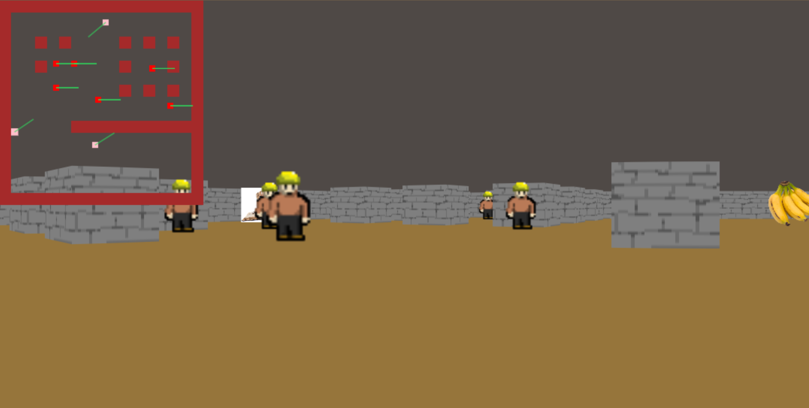

# RayCasting
A simple raycasting experiment.

It is a shooter game experiment based in the [raycasting](https://pt.wikipedia.org/wiki/Ray_casting) technique from the [Wolfenstein 3D](https://en.wikipedia.org/wiki/Wolfenstein_3D). The objective of this project is to be able to apply the raycasting technique in a grid map and, even though it's not the best project for it, to understand a bit a better about javascript.

Um experimento de raycasting simples.

É um experimento de shooter inspirado na técnica de [raycasting](https://pt.wikipedia.org/wiki/Ray_casting) dos primeiros jogos de [Wolfenstein](https://pt.m.wikipedia.org/wiki/Wolfenstein_3D).
O objetivo desse projeto é conseguir aplicar as técnicas de rayscasting
em um mapa com uma grid e, mesmo que não seja o melhor projeto para isso, entender um pouco mais de javascript no processo.

